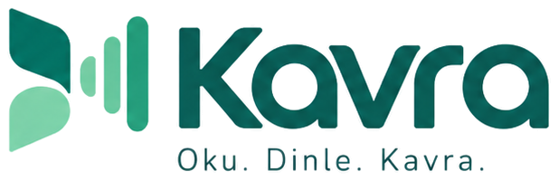

<p align="center">
  
</p>

<p align="center">
  Kaynak materyalini (PDF, PowerPoint, Markdown) sesli-görüntülü ders videosuna, flashcard destesine,<br>
  sınava ve çalışma planına dönüştüren yerel bir öğrenme stüdyosu.
</p>

---

Kavra; bir dersin PDF/PPTX/Markdown kaynağını alır, önce bir LLM ile **kavramsal bir ders anlatımına**
dönüştürür (ham metni ya da kod/tablo sembollerini olduğu gibi okumaz), sonra bunu seslendirip
görsel slaytlarla senkronize bir MP4'e render eder. Aynı kaynaktan flashcard destesi, sınav ve
çalışma takibi de üretilebilir — hepsi tek bir ders projesinin içinde.

## Öne çıkanlar

- **Ders videosu üretimi** — PDF/PPTX/Markdown kaynağından, altyazılı ve temalı bir MP4. Slayt
  metni değişmediği sürece render önbellekten gelir; yalnızca değişen slaytlar yeniden üretilir.
- **PDF sayfasını birebir anlat** veya kaynağı yeniden tasarlanmış slaytlara çevir.
- **Çok kaynaklı ders projeleri** — bir derse birden fazla dosya ekle, istediğin kaynak
  kombinasyonundan ayrı video/flashcard/sınav üret. Ayrıntı: [COURSE_PROJECTS.md](COURSE_PROJECTS.md).
- **Flashcard çalışma masası** — Anki benzeri öğrenme adımları, günlük limitler, geri alma,
  cloze kartlar. Ayrıntı: [FLASHCARD_GUIDE.md](FLASHCARD_GUIDE.md).
- **Sınav hazırlama** — şıklı/klasik/karma sınav, çözme ekranı, cevap anahtarı. Ayrıntı:
  [EXAM_GUIDE.md](EXAM_GUIDE.md).
- **Çalışma takibi** — görev/klasör hiyerarşisi, Pomodoro, süre raporları; yapay zekâ kullanmaz.
  Ayrıntı: [STUDY_TRACKER_GUIDE.md](STUDY_TRACKER_GUIDE.md).
- **Altı LLM/TTS sağlayıcı seçeneği** — bulut, yerel veya kendi Agent CLI'n; aşağıdaki tabloya bak.
- **Uzak GPU desteği** — GPU'suz bir sunucuda çalıştırıp XTTS v2/Piper seslendirmesini kendi
  bilgisayarına veya Colab'a devredebilirsin. Ayrıntı: [REMOTE_TTS.md](REMOTE_TTS.md).
- **Docker ile taşınabilir** — bir VPS'e veya başka bir bilgisayara Docker Compose ile kurulur.
  Ayrıntı: [DOCKER.md](DOCKER.md).

## Hızlı başlangıç

### Docker ile (önerilen — VPS, başka bir bilgisayar veya yerelde)

```bash
git clone <repo-url> kavra && cd kavra
cp .env.example .env        # istersen GEMINI_API_KEY / OPENAI_API_KEY ekle
docker compose up -d --build
```

Arayüz: `http://127.0.0.1:8768`. GPU'suz bir sunucuya kuruyorsan `.env`'e `KAVRA_LOCAL_TTS=0` ekle
(ağır TTS motorları kurulmaz, Edge-TTS/Piper yeterli olur; XTTS v2 için [REMOTE_TTS.md](REMOTE_TTS.md)'ye bak).
Sunucuda/VPS'te çalıştırmanın tam adımları (Tailscale, güvenlik, mevcut siteyle birlikte
çalıştırma): [DOCKER.md](DOCKER.md).

### Windows'ta yerel kurulum

Gereken: Python 3.14, Node.js 22+, FFmpeg.

```powershell
python -m venv venv
.\venv\Scripts\Activate.ps1
python -m pip install -r requirements.txt
python -m pip install -r requirements-tts.txt   # isteğe bağlı: XTTS v2/Anka için (CUDA gerektirir)
npm --prefix webui ci
npm --prefix webui run build
```

Sonra **`run_web.bat`**'ı çift tıkla (tarayıcı sekmesinde açar) veya **`run_gui.bat`**'ı çift tıkla
(ayrı bir masaüstü uygulama penceresinde açar). İkisi de aynı API'yi ve özellikleri kullanır.
Linux/macOS/Git Bash için `run_web.sh` kullanılabilir; CUDA olmayan makinelerde `requirements-tts.txt`
kurmana gerek yok, Edge-TTS ve Piper zaten çekirdek kurulumla çalışır.

## LLM sağlayıcıları (anlatı üretimi)

| Sağlayıcı | Not |
|---|---|
| **Gemini API** | Ücretsiz kotalı; `aistudio.google.com/apikey`'den anahtar al. |
| **OpenAI uyumlu API** | OpenAI, OpenRouter, LM Studio, Ollama veya başka bir uyumlu servis. |
| **Agent CLI** | Bilgisayarında kurulu bir CLI ajanı (ör. Claude Code) varsa API anahtarı gerekmez. |
| **Manuel** | Prompt'u kopyala, istediğin sohbet arayüzüne yapıştır, dönen JSON'u yükle. |

## TTS sağlayıcıları (seslendirme)

| Sağlayıcı | Kalite | Çevrimiçi mi | Not |
|---|---|---|---|
| **edge** (varsayılan) | Yüksek, doğal | Kısa internet isteği | Ücretsiz, API key yok |
| **piper** | Orta | Tamamen offline | Hafif ve hızlı, CPU'da bile hızlı |
| **elevenlabs** | En doğal | Bulut, API key gerekir | Ücretsiz kota sınırlı |
| **coqui** (XTTS v2) | Yüksek, ses klonlama | Offline (ilk indirme hariç) | GPU önerilir; CPML lisansı — ticari kullanım ayrı lisans ister |
| **anka** | Yüksek, Türkçe'ye özel eğitildi | Offline (ilk indirme hariç) | XTTS'ten hızlı; CC-BY-NC-4.0 — yalnızca kişisel/araştırma |
| **chatterbox** | Yüksek, ses klonlama, çok dilli | Offline (ayrı ortam) | GPU gerekir, ayrı bir Python ortamında çalışır |

XTTS v2 ve Piper, GPU'suz bir sunucudan uzak bir GPU'ya (kendi bilgisayarın veya Colab) devredilebilir —
bkz. [REMOTE_TTS.md](REMOTE_TTS.md). Lisans notları özet niyetinedir; ticari kullanım öncesi ilgili
lisansı kendin doğrula.

## Video özellikleri

- Kart tabanlı modern slayt tasarımı; altı hazır tema (Beyaz Minimal, Notebook Açık, Gece Mavisi,
  Sıcak Kağıt, Mint Akademik, Aurora) ve içeriğe göre otomatik tema seçimi
- Kod blokları Pygments ile sözdizimi renklendirmeli
- Konuşmayla senkronize gömülü altyazı (Edge-TTS'te kelime bazlı, diğerlerinde tahmini)
- Yumuşak geçişler, isteğe bağlı Ken Burns efekti
- Slayt/ses/segment hash tabanlı önbellek: değişmeyen slaytlar yeniden render edilmez
- İptal edilebilir render; uygulama yeniden başlasa da kaldığı yerden devam eder

## Bilinen sınırlamalar

- Taranmış (image) PDF'lerde OCR yok; metin çıkmayan sayfalar boş kalır.
- Piper/ElevenLabs/Coqui/Anka/Chatterbox'ta altyazı zamanlaması tahminidir (Edge-TTS kadar hassas değil).
- Coqui/Chatterbox CPU'da yavaştır; büyük bir dersi GPU'suz üretmek saatler sürebilir.
- Çok büyük bir kaynağı (100+ bölüm) tek seferde işlemek yerine bölüm bölüm ilerlemek önerilir.

PDF görsel destekli anlatım kalitesi için planlanan iyileştirmeler: [YAPILACAKLAR.md](YAPILACAKLAR.md).

## Klasör yapısı

```
kavra/
  app/                  çekirdek Python paketi (parser, LLM, TTS, video, pipeline)
  studio_web/           FastAPI backend, render worker, uzak TTS rotaları
  webui/                React arayüzü
  tts_server/           uzak GPU sunucusu (bkz. REMOTE_TTS.md)
  prompts/              LLM'e verilen ders anlatım prompt şablonu
  models/               offline ses modelleri ve klon referansları (kullanıcı verisi)
  projects/             ders/kaynak/video/flashcard/sınav verisi (kullanıcı verisi)
  study_data/           çalışma takibi SQLite verisi (kullanıcı verisi)
  Dockerfile, compose.yaml   taşınabilir kurulum
```

## Belgeler

| Belge | İçerik |
|---|---|
| [DOCKER.md](DOCKER.md) | Docker/Compose kurulumu, VPS'e taşıma, Tailscale ile güvenli erişim |
| [REMOTE_TTS.md](REMOTE_TTS.md) | GPU'suz sunucudan kendi bilgisayarına/Colab'a seslendirme devri |
| [COURSE_PROJECTS.md](COURSE_PROJECTS.md) | Çok kaynaklı ders projeleri |
| [FLASHCARD_GUIDE.md](FLASHCARD_GUIDE.md) | Flashcard çalışma masası |
| [EXAM_GUIDE.md](EXAM_GUIDE.md) | Sınav hazırlama ve çözme |
| [STUDY_TRACKER_GUIDE.md](STUDY_TRACKER_GUIDE.md) | Görev/süre takibi |
